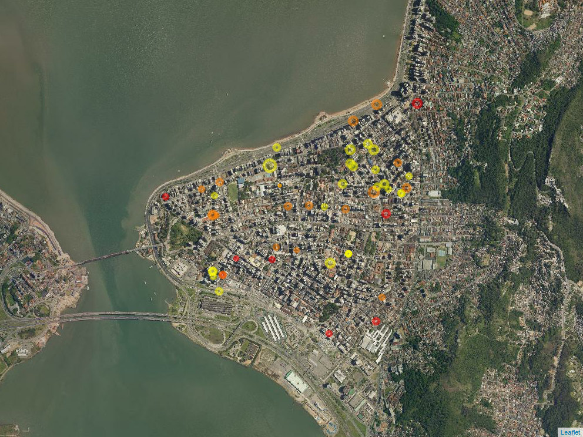

```{r setup, include=FALSE}
knitr::opts_chunk$set(echo = TRUE, warning = FALSE, message = FALSE, 
                      fig.align = "center", fig.pos = "H", fig.path = "images/", 
                      out.width = "65%", dev = "CairoPNG", dpi = 600)
library(appraiseR)
library(knitr)
library(kableExtra)
library(ggplot2)
library(cowplot)
theme_set(theme_cowplot(12))
library(car)
library(sf)
```

# Introdução

\pkg{appraiseR} é um pacote de software \proglang{R} que busca facilitar a
prática da Engenharia de Avaliações com a utilização de *software* livre, 
conforme as recomendações da NBR 14.653-02 [-@NBR1465302]. 

A confecção deste pacote também busca facilitar o ensino da Engenharia de
Avaliações, assim como da Ciência Estatística aos novos avaliadores, já que 
atualmente o ensino normalmente depende da utilização de um *software* comercial, 
haja vista as dificuldades para tratamento dos dados, ajuste de modelos e
verificações das hipóteses básicas com a utilização das planilhas eletrônicas
comuns.

Foi escolhida a linguagem \proglang{R} devido à facilidade de programação nesta
linguagem, à disponibilidade de uma infinidade de métodos e testes estatísticos
pré-programados e à disponibilidade de poderosas ferramentas gráficas dentro do
ambiente \proglang{R}, seja através dos gráficos do pacote básico, seja através
dos gráficos gerados com os pacotes \pkg{ggplot2} [@ggplot2] e \pkg{lattice} 
[@lattice].

# Conjuntos de dados disponíveis

Foram disponibilizados alguns conjuntos de dados visando possibilitar a
confecção de testes dos algoritmos implementados, bem como a avaliação da 
possibilidade de aplicação de novos métodos estatísticos na Engenharia de
Avaliações. Foram acrescentados ainda dados de novos trabalhos visando garantir
a sua reprodutibilidade técnica.

Desta forma, procura-se acrescentar, sempre que possível, dados de trabalhos 
mais novos produzidos pelo Grupo de Pesquisa em Engenharia de Avaliações e 
Perícias da UFSC (GEAP/UFSC) no Programa de Pós-Graduação em Engenharia de 
Transportes e Gestão Territorial (PPGTG) [ver @zilli2020] assim como dados de 
trabalhos anteriores produzidos ainda no Programa de Pós-Graduação em Engenharia 
Civil [@trivelloni].

Quando disponíveis as coordenadas dos pontos, os dados são disponibilizados como
um objeto do tipo `sf` (*simple features*), do pacote \pkg{sf} [@sf], o que visa
facilitar a confecção de mapas com os dados e análises geoespaciais.

Um destes é um conjunto de [50 dados de apartamentos em
Florianópolis](https://lfpdroubi.github.io/appraiseR/reference/centro_2015.html)
[@hochheim2015], que será utilizado neste texto, fins de demonstrar o 
funcionamento do pacote.

```{r}
dados <- centro_2015
dados <- within(dados, VU <- valor/area_total)
```

Como os dados estão geoespacializados é possível confeccionar um simples mapa
com o auxílio do pacote \pkg{leaflet} [@leaflet], como pode ser visto na 
Figura \ref{fig:mapa}, onde os círculos tem tamanhos proporcionais aos valores
unitários dos imóveis e cores representando os padrões de acabamento de cada
um (baixo padrão em vermelho, médio padrão em laranja e alto padrão em amarelo).

```{r}
library(leaflet)
dados <- st_transform(dados, 4326)
factpal <- colorFactor(heat.colors(3), dados$padrao)
m <- dados %>% 
  leaflet() %>% 
  addWMSTiles(baseUrl = "http://sigsc.sc.gov.br/sigserver/SIGSC/wms", 
              layers = list("OrtoRGB-Landsat-2012"))%>% 
  addCircleMarkers(radius = ~VU/1000, color = ~factpal(padrao))
```

```{r mapa, fig.cap="Espacialização dos dados sobre ortofotos do Estado de Santa Catarina.", out.width="90%", echo = FALSE}
mapview::mapshot(m, file = "./images/mapa_dados.png", 
                 remove_controls = TRUE)

```


Os modelos podem ser ajustados com as variáveis qualitativas na forma de 
caracteres ou fatores (situação em que o \proglang{R} automaticamente as 
transforma em variáveis dicotômicas em grupo para o ajuste do modelo).

Por uma questão de compatibilidade com o exemplo disponível em Hochheim
[-@hochheim2015], no entanto, efetua-se a transformação da variável qualitativa
`padrao` para o formato código alocado (numérico):

```{r}
dados <- within(dados, padrao <- as.numeric(padrao))
```

# Análise exploratória de dados

Em relação à análise exploratória de dados, a NBR 14.653-2 [-@NBR1465302] 
recomenda, em seu item A.2.1.1:

> Recomenda-se ser analisado, primeiramente, o comportamento gráfico da variável
dependente em relação a cada variável independente, em escala original. Isto
pode orientar o avaliador na transformação a adotar.

```{r graficoDF, fig.cap = "Comportamento gráfico da variável dependente em relação a cada variável independente, em escala original.", out.width="100%"}
plt <- plotdf(valor ~ area_total + quartos + suites + garagens +
                dist_b_mar + padrao, data = dados)
print(plt)
```

Neste mesmo item, a NBR 14.653-02 ainda recomenda que:

> As transformações utilizadas para linearizar o modelo devem, tanto quanto
possível, refletir o comportamento do mercado, com preferência pelas
transformações mais simples de variáveis, que resultem em modelo satisfatório.
Após as transformações realizadas, se houver, examina-se a linearidade do
modelo, pela construção de gráficos dos valores observados para a variável
dependente versus cada variável independente, com as respectivas transformações.

```{r graficoDF2, fig.cap = "Comportamento gráfico da variável dependente em relação a cada variável independente, com respectivas transformações.", out.width="100%"}
plt1 <- plotdf(log(valor) ~ area_total + quartos + suites + garagens + 
                 log(dist_b_mar) + I(1/padrao), data = dados)
print(plt1)
```


# Seleção de modelos

A seleção de modelos pode ser feita através da função `bestfit`, fornecendo-se 
uma fórmula com as variáveis desejadas, sem qualquer transformação (o algoritmo
se encarrega de testar as transformações). As transformações a serem testadas
são fornecidas pelo argumento `transf`. Também é possível remover *outliers* e/ou
pontos influenciantes através do argumento `subset`. Dados amostrais com alguma
informação faltante serão automaticamente removidos.

Em alguns conjuntos de dados, como este em análise, os dados para os 
bens-avaliandos são incluídos no próprio conjunto de dados, sem a informação de
valor. Estes dados, portanto, não são utilizados na confecção do modelo.

```{r}
best_fits <- bestfit(valor~area_total + quartos + suites + garagens + 
                       dist_b_mar + padrao, data = dados,
                     transf = c("rec", "rsqrt", "log", "sqrt"),
                     subset = -c(31, 39))
```

O pacote gera um objeto da classe `bestfit`.

```{r}
class(best_fits)
```

Uma vez feitas as combinações de transformações, elas podem ser vistas no
console do \proglang{R}, ordenadas pelo critério do maior $R^2_{ajustado}$:

```{r}
print(best_fits)
```


Foi desenvolvido um método `summary` para os objetos da class `bestfit`, que,
por padrão, imprime no console um sumário do modelo mais ajustado:

```{r}
summary(best_fits)
```

Pode-se escolher, no entanto, qualquer modelo da lista, através da adição do
argumento `fit`, fornecendo o número do modelo desejado. No entanto, é sabido
que pode não ser tarefa fácil encontrar um modelo adequado em meio a tantas
transformações[^1].

Recomenda-se, portanto, tentar encontrar a transformação mais adequada para a 
variável dependente através da análise do gráfico do perfil de 
log-verossimilhança das possíveis transformações com a família de Box-Cox, como,
aliás, já recomenda a própria NBR 14.653-02 [-@NBR1465302, A.2.1.1]:

> Existem formas estatísticas de se buscar a transformação mais adequada, como,
por exemplo, os procedimentos de Box e Cox.

No \proglang{R}, isto pode ser feito facilmente através da utilização da função 
`boxCox` do pacote \pkg{car} [@car], como abaixo:

```{r boxcox, fig.cap="Perfil da Log-Verossimilhança do parâmetro $\\lambda$ da família de Box-Cox"}
library(car)
fit <- lm(valor ~ area_total + quartos + suites + garagens + dist_b_mar + padrao, 
          data = dados)
s <- summary(fit)
boxCox(fit)
```

A partir da análise da Figura \ref{fig:boxcox}, pode-se restringir a busca aos
modelos que utilizam a transformação logarítmica à variável dependente, já que
$\lambda = 0$ ([-0,1; 0,3] \@95\%).

A tabelas das transformações aplicadas a cada variável do modelo fica armazenada 
sob o nome de `tabs` dentro do objeto.

```{r}
names(best_fits)
```

Por exemplo, pode-se selecionar apenas os modelos cuja transformação da variável
resposta foi a transformação logaritmica.

```{r}
options(digits = 3)
df <- best_fits$tab
logs <- df[which(df$valor == "log"), ]
head(logs)
```

Pode-se, então, selecionar o sumário de um modelo diferente, através da escolha
apropriada do `id` na tabela acima.

```{r}
summary(best_fits, fit = 514)
```

[^1]: No RStudio, a maneira mais fácil de pesquisar os modelos é aplicar a função 
`View` à tabela de transformações.

# Diagnósticos

Uma das vantagens de utilizar o \proglang{R} é que existem diversos pacotes com funções
disponíveis para elaborar uma série de diagnósticos sobre os modelos de
avaliação ajustados.

Abaixo ilustramos alguns testes de normalidade previstos pela NBR 14.653-02:

```{r}
# Modelo adotado (514)
fit <- summary(best_fits, fit = 514)$fit
```

## Normalidade

Existem diversos pacotes com funções para a verificação da normalidade, dentre 
os quais destacam-se os pacotes \pkg{nortest} [@nortest] e \pkg{normtest}.
[@normtest]

```{r}
library(nortest)
library(normtest)
```

a.  Teste do $\chi^2$:

```{r}
pearson.test(resid(fit))
```

b. Teste de Jarque-Bera:

```{r jarquebera}
jb.norm.test(resid(fit))
```

Alguns testes não previstos no texto normativo, porém de grande poder, também
estão disponíveis, como o teste de Shapiro-Wilk [@razali].

c. Shapiro-Wilk:

```{r}
shapiro.test(resid(fit))
```

d. Teste K-S (Kolgomorov-Smirnov) [@KS]

```{r KS, fig.cap='Curva da função de distribuição acumulada (FDA) empírica'}
KS(fit)
```

e. Histograma


```{r histograma, fig.cap='Histograma dos resíduos padronizados', out.width="45%"}
res <- data.frame(residuals = rstandard(fit))
ggplot(res, aes(residuals)) + 
  geom_histogram(aes(y = ..density..), bins = 6) + 
  stat_function(fun = dnorm,
                args = list(mean = mean(res$residuals), sd = sd(res$residuals)),
                lwd = 2, col = 'red')
```

## Homoscedasticidade

Também alguns testes de verificação da homoscedasticidade podem ser facilmente 
aplicados, como o teste de Breusch-Pagan, através do pacote \pkg{lmtest} 
[@lmtest]:

```{r}
library(lmtest)
bptest(fit)
```

A detecção da heteroscedasticidade, no entanto, pode ser difícil através da 
simples aplicação de testes [ver @deteccao]. A análise dos gráficos dos resíduos
vs. valores previstos é mais adequada na maioria das vezes. A linguagem 
\proglang{R} ainda é reconhecida pela alta qualidade dos gráficos que podem ser produzidos com ela. Os gráficos padrão para diagnóstico dos modelos de regressão 
linear, por exemplo, podem ser vistos na Figura \ref{fig:plotFit} abaixo:

```{r plotFit, fig.cap="Diagnóstico do modelo de regressão adotado.", fig.show = "hold", out.width="30%"}
plot(fit, which = 1:6)
```

Além dos testes já existentes no \proglang{R}, procurou-se criar funções que
auxiliem na verificação da razoabilidade dos modelos ajustados, conforme
solicita a NBR 14.653-02.

Além da verificação da homoscedasticidade, saliente-se, é possível[^2] também a 
utilização do modelo com segurança através do emprego de erros robustos [ver 
@zonato2018], o que é possível no \proglang{R}, através do pacote \pkg{sandwich} 
[@zeileis].

[^2]: A NBR 14.653-02 não trata desta possibilidade.

## Gráficos do modelo

É possíve elaborar gráficos do modelo através da função `plotModel`:

```{r modelsPlot1, fig.cap="Gráficos do modelo com outras variáveis em seus valores medianos.", out.width="75%", fig.width=9, fig.height=6}
plotModel(best_fits, fit = 514)
```

É possível adicionar intervalos de confiança (ou predição) e escolher o nível de
confiança desejado, como pode ser visto na Figura \ref{fig:modelsPlot2}:

```{r modelsPlot2, fig.cap = "Gráficos do modelo com intervalos de predição (80\\%).", out.width="85%", fig.width=9, fig.height=6}
plotModel(best_fits, fit = 514, interval = "confidence", level = 0.80)
```

Para visualizar o comportamento do modelo no local de avaliação é preciso 
fornecer o argumento `local`, onde são fornecidos os valores das características
do bem-avaliando. O resultado pode ser visto na Figura \ref{fig:modelsPlot3}, em 
que o ponto vermelho representa o bem-avaliando, com os intervalos de predição.

Juntamente aos gráficos obtidos, serão impressos no console os valores da 
elasticidade do modelo no ponto de avaliação, em porcentagem. Estas porcentagens
foram calculadas considerando uma mudança de 10% em cada regressor.

Finalmente, é possível, ainda, acrescentar os limites superior e inferior do
Campo de Arbítrio do Avaliador, representado pelas linhas tracejadas na Figura
\ref{fig:modelsPlot4}, acompanhado ou não do valor arbitrado para o
bem-avaliando (em roxo). Note-se também que, para este gráfico, optou-se pela
plotagem de ambos os intervalos, de confiança e de predição, através do uso do
argumento `interval = "both"`.

```{r modelsPlot3, fig.cap = "Gráficos do modelo no ponto de previsão de valores.", out.width="85%", fig.width=9, fig.height=6}
plotModel(best_fits, fit = 514, interval = "prediction", level = 0.80,
         local = list(area_total = 205, quartos = 3, suites = 1, garagens = 2,
         dist_b_mar = 250, padrao = 2))
```

```{r modelsPlot4, fig.cap = "Gráficos do modelo no ponto de previsão de valores, acompanhado do valor arbitrado, ambos os intervalos e limites do Campo de Arbítrio.", out.width="85%", fig.width=9, fig.height=6}
plotModel(best_fits, fit = 514, interval = "both", level = 0.80, func = "log", 
        local = list(area_total = 205, quartos = 3, suites = 1, garagens = 2, 
                     dist_b_mar = 250, padrao = 2), ca = TRUE, av = 1100000)
```

Perceber que neste caso, como os gráficos foram plotados na escala original,
as elasticidades são maiores. Isto ocorre porque, no gráfico anterior, as 
elasticidades foram calculadas na escala logarítmica, que é uma transformação
não-linear. Deve-se atentar, portanto, para este fato, haja vista que, em geral,
os avaliadores devem estar preocupados com o comportamento dos preços em sua 
escala original e não na sua escala transformada.

## Poder de Predição

A função `powerPlot` ajusta o gráfico do poder de predição do modelo. Por
padrão, a função `powerPlot` ajusta o poder de predição do modelo de maior
$R^2_{ajustado}$. Porém, como em outras funções, é possível selecionar outros
modelos da tabela. Na Figura \ref{fig:powerPlot2} pode ser visto o gráfico do
Poder de Predição para o modelo escolhido.

Existe ainda um argumento que possibilita a inversão dos eixos do gráfico do
poder de predição, o que não vai ao encontro do que recomenda a NBR 14.653-02,
porém é recomendado pelos estatísticos, dado o fenômeno do encolhimento dos
valores ajustados. Basta, para isto, fornecer o argumento `axis` à função, o que
resulta no gráfico da Figura \ref{fig:powerPlots} A[^3].

[^3]: Neste caso a diferença foi quase nula, mas em modelos com menor grau de
ajuste é possível perceber a diferença entre a escolha de plotar os valores
ajustados nas abscissas ou nas ordenadas: a escolha de plotar os valores
ajustados nas ordenadas pode dar a falsa impressão de que o modelo é viesado
[ver @droubi2019].


```{r powerPlot2, fig.cap="Poder de Predição: modelo escolhido."}
powerPlot(best_fits, fit = 514)
```


```{r powerPlot3, eval=FALSE}
powerPlot(best_fits, fit = 514, axis = "inverted")
```

Uma última opção é o ajuste do gráfico do poder de predição na escala original, 
conforme Figura \ref{fig:powerPlots} B, uma vez que na escala transformada o 
modelo pode parecer razoável, mas na escala original o resultado pode ficar bem 
aquém do esperado.

```{r powerPlot4, eval = FALSE}
powerPlot(best_fits, fit = 514, func = "log", axis = "inverted")
```

```{r powerPlots, echo = FALSE, out.width="85%", fig.cap="Poder de Predição na escala transformada (A) e original (B)."}
pp3 <- powerPlot(best_fits, fit = 514, axis = "inverted")
pp4 <- powerPlot(best_fits, fit = 514, func = "log", axis = "inverted")
plot_grid(pp3, pp4, labels = "AUTO")
```


## Grau de precisão

As previsões podem ser feitas pela função `predict` aplicada ao método `bestfit`.
Ao imprimí-las no console, serão mostrados os limites do intervalo escolhido, 
do campo de arbítrio, bem como a amplitude do intervalo e seu grau de precisão,
segundo a NBR 14.653-02.

É possível fornecer parâmetros para a escolha das características dos imóveis
a serem previstos através do argumento `newdata` (não mostrado). Caso não 
sejam fornecidos novos dados para ajuste, a função automaticamente irá procurar
pelo(s) avaliando(s) no próprio conjunto de dados utilizado para ajustar o 
modelo (dados cuja variável resposta não tenha valores). Neste caso, três dados
foram inclusos no conjunto, com as características descritas na tabela 
\ref{tab:avaliandos}.

```{r avaliandos, echo = FALSE}
kable(st_drop_geometry(dados[51:53, 2:7]), booktabs = TRUE,
      caption = "Características dos avaliandos.") %>% 
  kable_styling(latex_options = c("striped", "HOLD_position"))
```

Além dos valores previstos e os limites do intervalo escolhido, são mostradas a
amplitude do intervalo, o grau de precisão, os limites do campo de arbítrio e os
limites de valores admissíveis (valores mais restritos entre o Campo de Arbítrio
e os limites do intervalo escolhido).

```{r}
p <- predict(best_fits, fit = 514, interval = "confidence")
p
```

```{r}
p1 <- predict(best_fits, fit = 514, interval = "prediction")
p1
```

## Arbitragem de valores

Para arbitragem de valores, recomenda-se a utilização do pacote `mosaic`
[@mosaic], visando a produção de gráficos como o da Figura \ref{fig:dist}, onde
as probabilidades de ocorrência de valores dentro dos limites inferior e superior 
do intervalo de valores admissíveis são calculadas. 

```{r}
new <- dados[51:53, ]
p <- exp(predict(fit, newdata = new, interval = "prediction", level = 0.80))
ca <- campo_arbitrio(p)
```

Na Figura \ref{fig:dist}, a área central corresponde à área delimitada pelos
limites do intervalo de valores admissíveis. No caso apresentado, o intervalo de
valores admissíveis está limitado pelo Campo de Arbítrio, que mostrou-se mais 
restrito do que o intervalo de predição. A probabilidade de ocorrência de 
valores acima ou abaixo destes limites no mercado estudado é de 24,8% para cada
lado.

```{r dist, fig.cap="Distribuição de probabilidades dos preços dos imóveis no mercado, dadas as características do bem-avaliando.", fig.height = 3, out.width="100%"}
library(mosaic)
pl1 <- 
  xpnorm(c(max(ca[2, "C.A.I."], p[2, "lwr"]), min(ca[2, "C.A.S."], p[2, "upr"])), 
           mean = p[2, "fit"], sd = s$sigma, 
           return = "plot", system = "gg", digits=3) + 
  theme(legend.position="bottom") + 
  guides(fill=guide_legend(title="Prob."))
pl1
```


# Parâmetros de outras normas técnicas

É possível, ainda, calcular os indicadores de performance da avaliação em massa,
de acordo com a *International Association of Assessing Officers* [@iaao], como 
a Mediana das Razões de Avaliação, o Coeficiente de Dispersão da Mediana (COD) e 
o Diferencial Relativo do Preço (PRD):

```{r, echo = FALSE, eval = FALSE}
data("zilli_2020")
zilli_2020$PC <- as.numeric(zilli_2020$PC)
fefit <- lm(log(VU) ~ log(AP) + log(DABM) + ND + NB + NG + PSN + PC + BRO, 
 data = zilli_2020[1:190, ], subset = -c(86, 115))
new <- zilli_2020[c(191:203, 205:225), ]
fitted <- predict(fefit, newdata = new)
iaao_Ratio(exp(fitted), new[ , "VU", drop = TRUE])
```

```{r}
library(broom)
dados <- augment(fit)
iaao_Ratio(exp(dados$.fitted), exp(dados$`log(valor)`))
```


# Conclusão

Como mostrado, a confecção de um pacote \proglang{R} pode servir a múltiplas
finalidades, desde a sua utilização para o ensino, como visando a
reprodutibilidade técnica de análises presentes em artigos e outros textos
científicos, ou mesmo visando o auxílio na prática profissional aos
profissionais da área.

Obviamente que, por se tratar de *software livre*, o pacote descrito (*appraiseR*)
não propicia nenhuma garantia ao utilizador profissional, conforme a própria
[licença de utilização](https://raw.githubusercontent.com/lfpdroubi/appraiseR/master/LICENSE) 
já prevê.

O pacote atualmente encontra-se hospedado em 
[repositório de software](https://github.com/lfpdroubi/appraiseR) em que 
são bem-vindas críticas, sugestões, contribuições e relatos de mal funcionamento
(*bugs*).

Algumas funcionalidades não foram descritas neste artigo, por questões de 
limitação de espaço. Mais informações sobre a utilização de outras funções podem 
ser encontradas no [site do pacote](https://lfpdroubi.github.io/appraiseR/).

# Desenvolvimento Futuro

O pacote continua em desenvolvimento contínuo. Pretende-se acrescentar funções
para facilitar o uso de outros métodos estatísticos na Engenharia de Avaliações,
como os modelos mistos, que são úteis para lidar com amostras heterogêneas, como
na confecção de plantas de valores genéricos e índices de preços.

Pretende-se ainda elaborar um manual do usuário com fins didáticos e uma espécie
de interface gráfica, como um painel de controle, que dispense a necessidade de
digitação de códigos em linhas de comando para a utilização do pacote.

# Agradecimentos

Fica aqui um agradecimento aos colegas do Grupo de Pesquisa em Engenharia de
Avaliações e Perícias da UFSC (GEAP/UFSC), especialmente ao colega Carlos Zilli,
pelo auxílio na revisão, além de um agradecimento especial ao colega
Augusto Oliveira, da SEFIN do município de Fortaleza, pela contribuição com a
elaboração das funções para o cálculo dos indicadores de performance segundo a
IAAO e pela utilização e testes do pacote.

# Referências {-}
